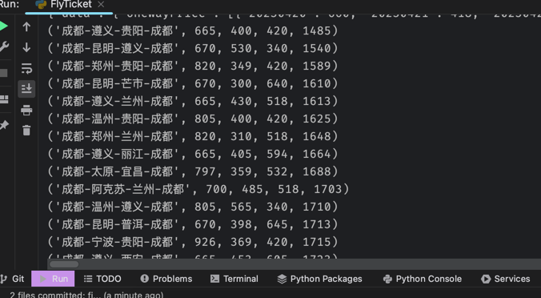

# 使用说明
------
## 1. 项目介绍
------
### 1.1 项目背景
始于五一节买机票，发现头尾价格极高，中间价格极低，于是想试试看可否以三程组合的方式实现最低价，同时尽可能去多的地方。于是就有了这个项目。

### 1.2 项目功能
假设你选定的出发城市为A，根据A查询出 A-B-C-A 的最便宜机票组合(以组合价格升序排列) 

### 1.3 项目实现
假设你所在城市为CTU
1. 以CTU为出发城市A，查询最低价机票前N名的城市列表作为中转城市B
2. 以中转城市B为出发城市，查询最低价机票前N名的城市列表为中转城市C
3. 查询所有C返回A的机票
4. 以组合价格升序排列

### 1.4 项目优化
本实现并非最优实现，代码建立在出发当天为机票溢价最高的情况下

## 2. 项目使用

### 2.1 项目依赖
1. python 3.6+

### 2.2 项目运行
python3 3stage_cheapest_ticket.py

### 2.3 正确运行后结果

### 2.4 注意事项
1. 项目中使用了多线程，如果你的机器性能不够，可以将线程数调小
2. 项目中使用了携程的机票借口，不知道会不会被封或者何时被封，请据情况自行调整
3. 携程接口中有机器人验证，当你的请求过于频繁时，此时脚本会调用浏览器打开机器人验证窗口，需要你自行验证，然后按回车继续（如果回车后报错请重新运行）
4. 项目中维护了一个城市：城市代码的映射，如果你的城市或你的目标城市不在这个映射中，可以自行添加
5. 此项目非常简陋，仅供参考，如果你有更好的实现方式，请自行修改
6. 70%代码来自于chatGPT，感谢chatGPT
7. 携程API接口来自于 https://github.com/xiaoeno/-xiechengjipiao_api 🙏